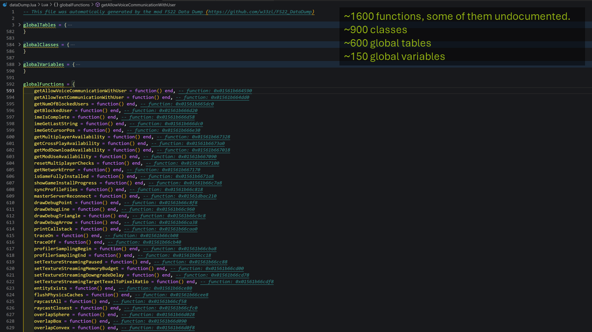
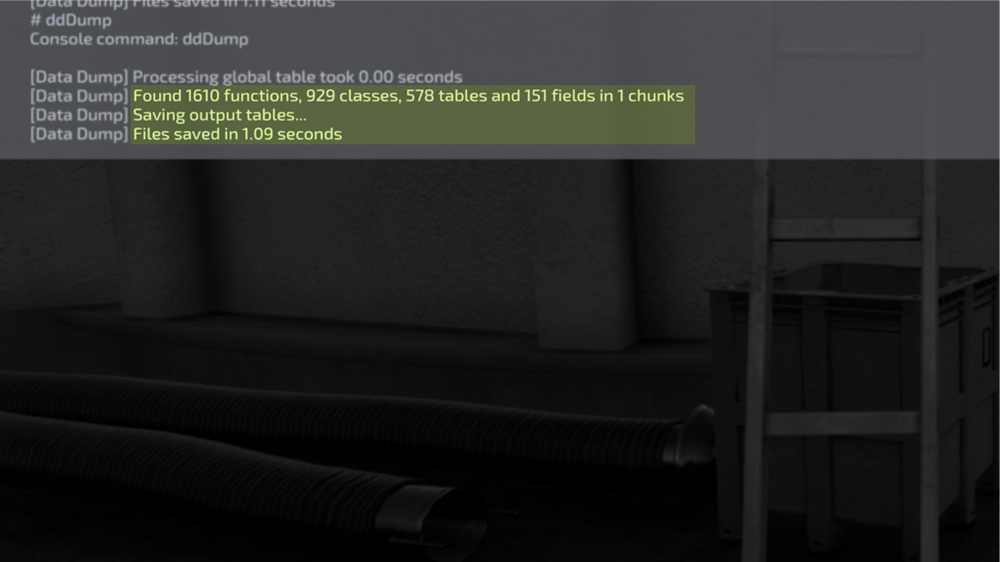

# Data Dump for Farming Simulator (FS22_DataDump)

The main purpose of this mod is to save the global tables, functions, classes and variables from Farming Simulator to files. Use these files to better understand the Farming Simulator object model through reverse engineering.

With these global objects as a starting point, you can then use the console command 'dtSaveTable' from the mod 'PowerTools: Developer' to write whole Lua tables (and full table hierarchies) to file for further analysis.

E.g. if the output of Data Dump contains a global table called 'g_gui' you can then execute the console command 'dtSaveTable g_gui g_gui.lua 10' to save the g_gui table to a file called g_gui.lua with a max dept of 10 levels.

## USAGE
1. Open the developer console in FS. 
2. Type 'ddDump' and hit [ENTER]
3. Review the files in the '..\Documents\My Games\FarmingSimulator2022\modSettings\FS22_000_DataDump' folder

## Download my mods
To download my mods, please visit my FS19 or FS22 page on the official Giants ModHub page:

## Open Modding Alliance
I'm a contributor and co-founder of the [Open Modding Alliance](https://github.com/open-modding-alliance) (OMA). The core of OMA is collaboration and knowledge sharing for the greater good of the Farming Simulator community. If you are a modder or create assets for FS I can recommend paying this page a visit:

## Connect with me
📫 Want to get in touch? If you have bugs to report or want to suggest improvements, it is easiest to send a ticket here on GitHub. Otherwise you can find me on Facebook, Patreon and Discord:

 *&nbsp;*  *&nbsp;* 

## Like the work I do?
I love to hear you feedback so please check out my [Facebook](https://www.facebook.com/w33zl). If you want to support me you can become my [Patron](https://www.patreon.com/wzlmodding) or buy me a [Ko-fi](https://ko-fi.com/w33zl) :heart:

 

